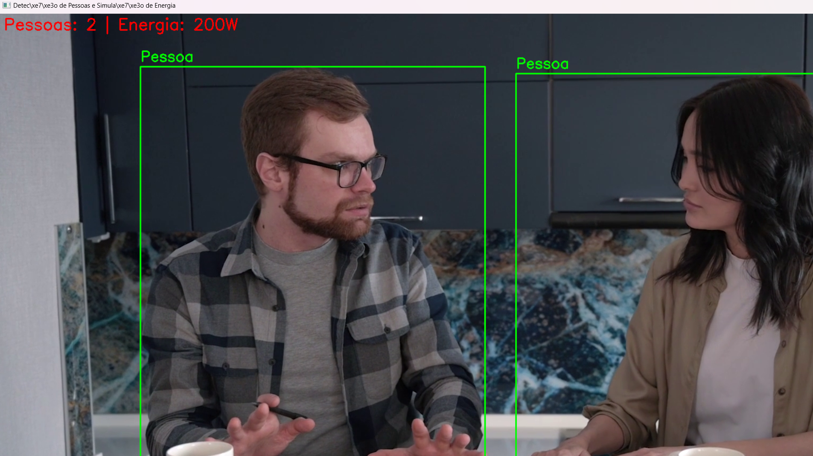
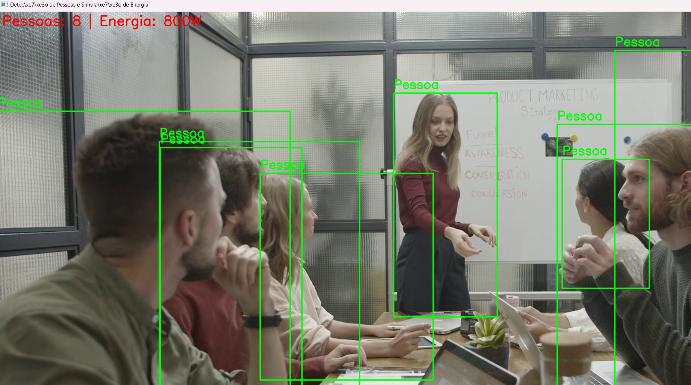
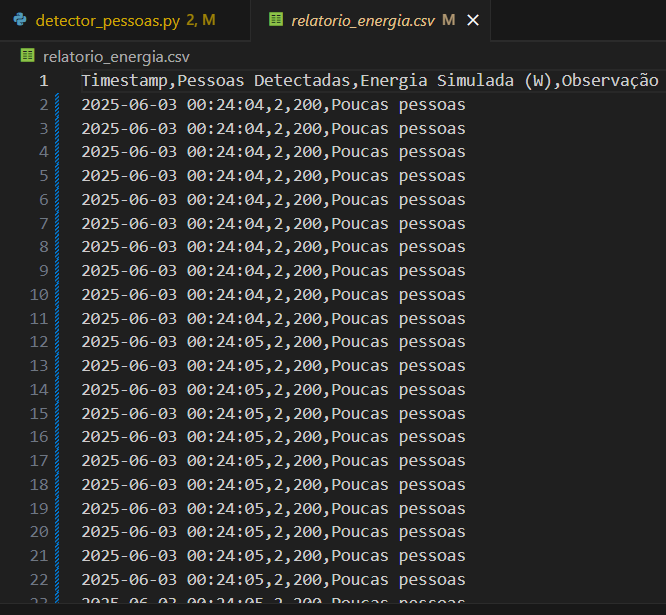

<h1>Integrantes</h1>

Tony Willian - RM550667

Henrique Parra - RM551973

Roberto Oliveira - RM551460

<h1>Problema</h1>

Em ambientes corporativos e residenciais, é comum o desperdício de energia elétrica causado pelo funcionamento contínuo de equipamentos mesmo na ausência de pessoas. Isso resulta em um consumo energético desnecessário, aumento de custos e impactos negativos ao meio ambiente.

Uma solução? Criar um sistema inteligente que ajuste automaticamente o fornecimento de energia de acordo com a presença de pessoas no ambiente, promovendo eficiência e sustentabilidade.

<h1>Visão Geral da Solução</h1>

Esse projeto propõe a criação de um sistema automatizado utilizando técnicas de visão computacional para identificar, em tempo real, a presença e a quantidade de pessoas em um determinado ambiente, a partir de vídeos ou de forma ao vivo.

Com base nos dados coletados, o sistema realiza uma simulação de consumo energético, calculando a quantidade ideal de energia necessária conforme a presença de pessoas no local. Essa informação possibilita ajustar automaticamente o fornecimento de energia para dispositivos como iluminação, climatização ou equipamentos eletrônicos. Para isso, foi usada a rede neural YOLOv8 da biblioteca Ultralytics, que oferece alta precisão e desempenho na detecção de múltiplas pessoas simultaneamente.

Além disso, todos os dados obtidos são organizados e exportados para um relatório em formato CSV, usado para análise sobre padrões de ocupação e consumo energético, servindo como base para estratégias de eficiência energética e redução de desperdícios.

<h1>Instruções de Uso</h1>

Para executar o projeto, é necessário instalar as bibliotecas utilizadas.
No terminal, digite:
pip install ultralytics opencv-python
  
Após a instalação, basta executar o script Python no terminal:
python detector_pessoas.py 

 Caso queira sair do vídeo enquanto ele está sendo mostrando, basta clicar em "Q"

O sistema fará a análise do vídeo e, ao final do processamento, um arquivo chamado saida_dados.csv será gerado automaticamente com todas as informações detectadas, como quantidade de pessoas por frame e a simulação de consumo de energia.

<h1>Link para o Vídeo</h1>

<a href="https://youtu.be/lf0H7KCB9qg" target="_blank">https://youtu.be/lf0H7KCB9qg</a>

<h1>Imagens Demonstração</h1>

